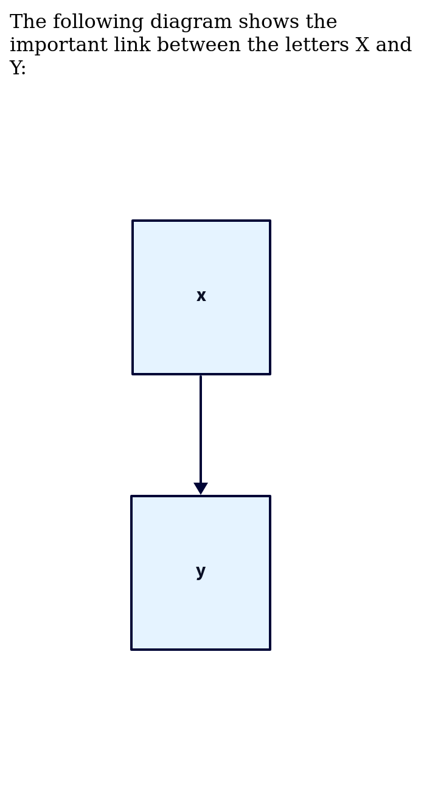

# Goldmark D2

[](https://pkg.go.dev/github.com/FurqanSoftware/goldmark-d2)

Goldmark D2 is a [Goldmark](https://github.com/yuin/goldmark) extension providing diagram support through [D2](https://d2lang.com/).

## Usage

``` go
goldmark.New(goldmark.WithExtensions(&Extender{})).Convert(src, dst)
```

## Example

<table>
<tr>
<td>

~~~markdown
The following diagram shows the important link between the letters X and Y:

```d2
x -> y
```
~~~

</td>
<td>



</td>
</tr>
</table>
