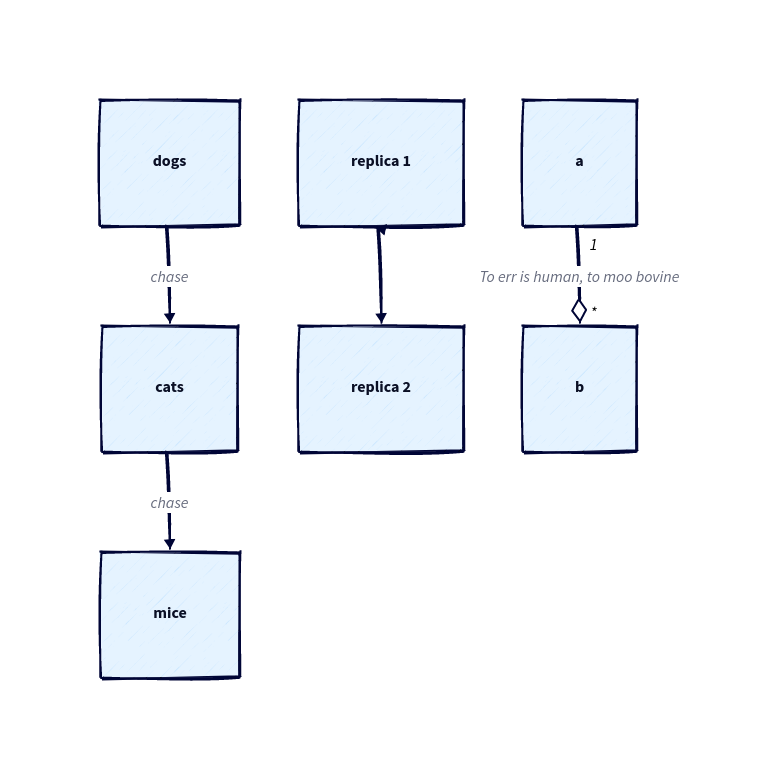

# Goldmark D2

[](https://pkg.go.dev/github.com/FurqanSoftware/goldmark-d2)

Goldmark D2 is a [Goldmark](https://github.com/yuin/goldmark) extension providing diagram support through [D2](https://d2lang.com/).

## Usage

``` go
goldmark.New(
	goldmark.WithExtensions(&Extender{
		// Defaults when omitted
		Layout:  d2dagrelayout.Layout,
		ThemeID: d2themescatalog.CoolClassics.ID,
	}),
).Convert(src, dst)
```

## Example

<table>
<tr>
<td>

~~~markdown
The following diagram shows the important link between the letters X and Y:

```d2
x -> y
```
~~~

</td>
<td>


</td>
</tr>

<tr>
<td>

{Sketch: true}

~~~markdown
```d2
dogs -> cats -> mice: chase
replica 1 <-> replica 2
a -> b: To err is human, to moo bovine {
  source-arrowhead: 1
  target-arrowhead: * {
    shape: diamond
  }
}
```
~~~

</td>
<td>



</td>
</tr>
</table>

## To-dos

- [x] Option for hand-drawn rendering

## More Goldmark Extensions

- [Katex](https://github.com/FurqanSoftware/goldmark-katex): math and equation support through [KaTeX](https://katex.org/)
