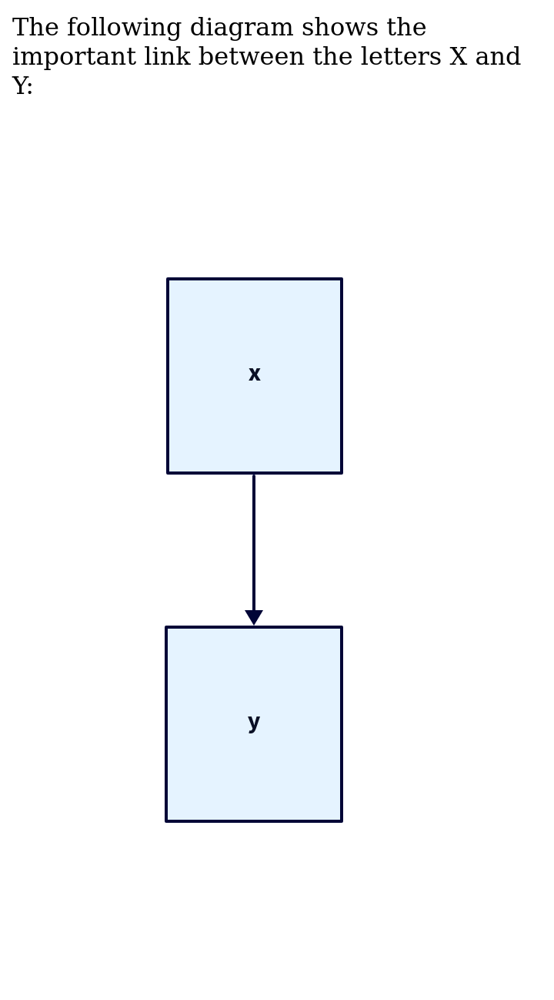
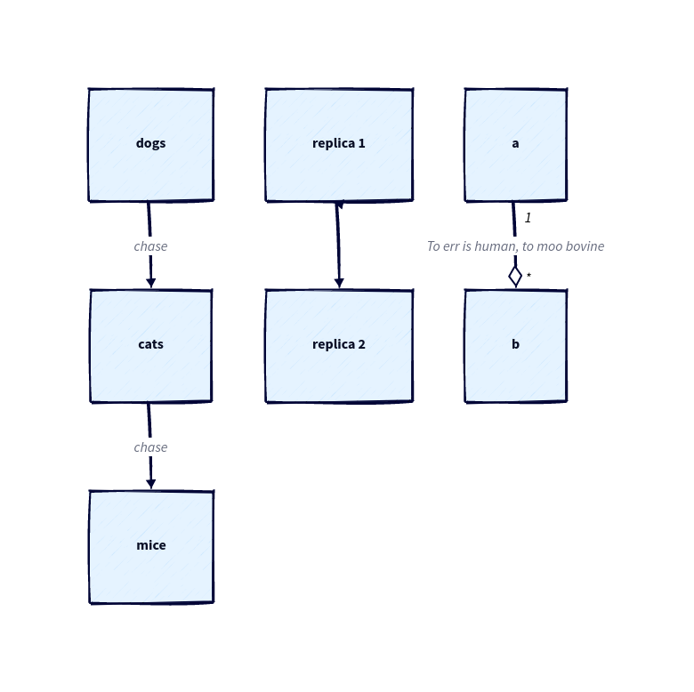

# Goldmark D2

[](https://pkg.go.dev/github.com/FurqanSoftware/goldmark-d2)

Goldmark D2 is a [Goldmark](https://github.com/yuin/goldmark) extension providing diagram support through [D2](https://d2lang.com/).

## Install

``` sh
go get github.com/FurqanSoftware/goldmark-d2
```

Requires Go 1.27 or later, inherited from D2 v0.8.

## Usage

``` go
import (
	d2 "github.com/FurqanSoftware/goldmark-d2"
	"github.com/d2lang/d2/d2themes/d2themescatalog"
	"github.com/yuin/goldmark"
)

goldmark.New(
	goldmark.WithExtensions(&d2.Extender{
		// Defaults when omitted
		Layout:  nil, // per-diagram, Dagre unless the block says otherwise
		ThemeID: &d2themescatalog.CoolClassics.ID,
		Sketch:  false,
	}),
).Convert(src, dst)
```

Every field is optional:

- `Layout` forces a layout engine on every diagram, and accepts any `d2graph.LayoutGraph`, including a configured one such as `d2elklayout.Layout` bound to its `ConfigurableOpts`. When omitted, each block is laid out by the engine it names itself (see below), which is Dagre unless stated otherwise.
- `ThemeID` selects a theme; see the `d2themescatalog` package for the catalog. Defaults to `CoolClassics`.
- `Sketch` renders diagrams in a hand-drawn style. Defaults to `false`.

### Layout engine

A block picks its own engine with D2's `layout-engine` config. Both `dagre` and `elk` are built in:

~~~markdown
```d2
vars: {
  d2-config: {
    layout-engine: elk
  }
}

a -> x
b -> x
c -> x
```
~~~

Setting `Layout` on the extender overrides this for every block.

## Output

Each `d2` block is replaced by an inline SVG wrapped in a `<div class="d2">`, which you can target for styling. The SVG carries its own `<style>`, so no additional CSS is needed.

A block that D2 cannot compile falls back to its source, HTML-escaped, in a `<pre><code>` inside the same wrapper. `Convert` still succeeds, so one bad diagram does not take down the rest of the document.

## Example

<table>
<tr>
<td>

~~~markdown
The following diagram shows the important link between the letters X and Y:

```d2
x -> y
```
~~~

</td>
<td>



</td>
</tr>

<tr>
<td>

{Sketch: true}

~~~markdown
```d2
dogs -> cats -> mice: chase
replica 1 <-> replica 2
a -> b: To err is human, to moo bovine {
  source-arrowhead: 1
  target-arrowhead: * {
    shape: diamond
  }
}
```
~~~

</td>
<td>



</td>
</tr>
</table>

## Upgrading

As of D2 v0.8, D2 moved from `oss.terrastruct.com/d2` to `github.com/d2lang/d2`. If you set `Layout` or `ThemeID`, update your own imports to match.

## More Goldmark Extensions

- [Katex](https://github.com/FurqanSoftware/goldmark-katex): math and equation support through [KaTeX](https://katex.org/)
